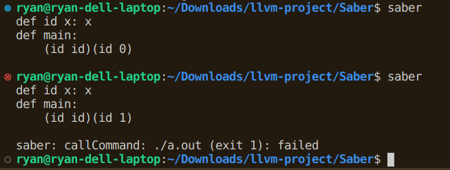

# Saber Programming Language

 - current situation: lambda calculus compiling to C (with bugs), with an Algorithm-J Hindley-Milner type inference pass. Polymorphic functions are specialized and a nonuniform memory representation is used. The below image shows the best example yet. `main` uses its return value as the program exit code, which is a temporary thing until I add proper I/O.
 
 - The executable is `dist-newstyle/build/x86_64-linux/ghc-8.8.4/saber-0.1.0.0/x/saber/build/saber/saber` in typical Cabal fashion. I recommend using an alias.
 - Call it with no arguments to type code in the terminal (this isn't done the most clever way). Otherwise, add a filename like `saber main.sb`. I use the `main.sb` at the top level of the repository. 
